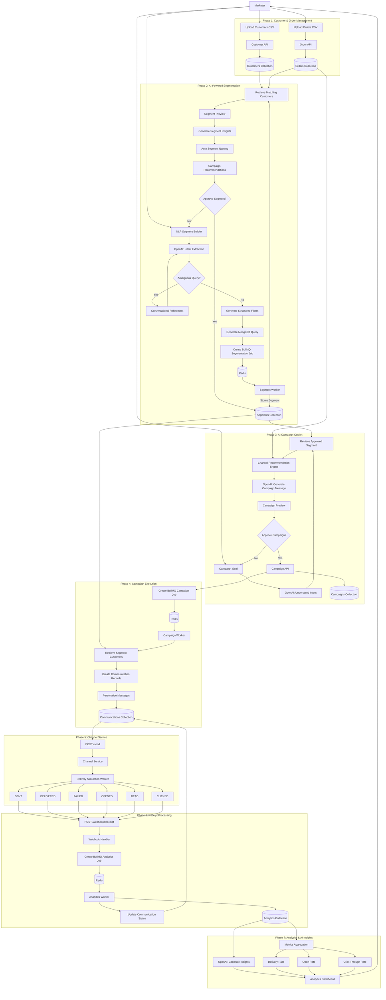

# Xeno System Architecture

Copy this Mermaid diagram into [Mermaid Live Editor](https://mermaid.live).



## Implementation Mapping

| Phase | Implemented In |
|-------|----------------|
| 1 | `customerController`, `orderController`, CSV import |
| 2 | `segmentWorker`, `openaiService`, `segmentInsightService`, `Segments.tsx` |
| 3 | `copilotService`, `Copilot.tsx`, campaign controllers |
| 4 | `campaignWorker`, `campaignService` |
| 5 | `channel-service` simulation |
| 6 | `analyticsWorker`, `webhookController`, `AnalyticsEvent` model |
| 7 | `analyticsInsightService`, `Dashboard.tsx` |

## Running Workers

```bash
# Without Redis (inline jobs — dev default)
USE_INLINE_JOBS=true npm run dev

# With Redis + BullMQ workers
REDIS_URL=redis://localhost:6379 npm run dev
npm run dev:worker   # separate terminal
```
